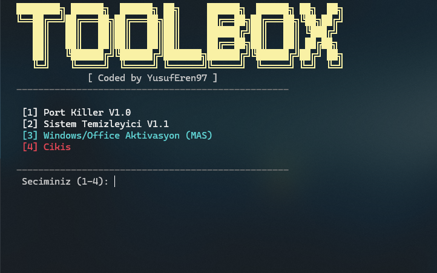
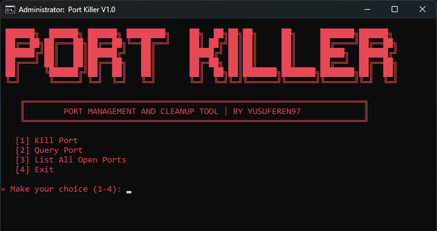
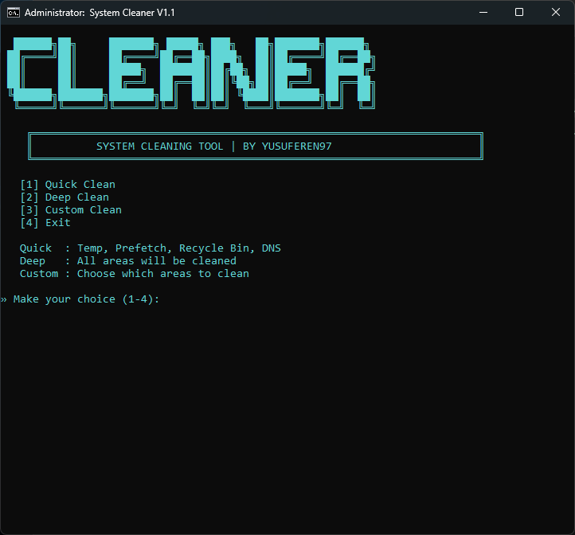

# 🛠️ Toolbox





A powerful Windows utility toolkit that runs directly from PowerShell. Includes port management, system cleaning, and Windows/Office activation tools.

## --> Quick Start

**One-line install — just paste into PowerShell:**

```powershell
irm yusuferenseyrek.com.tr/toolbox | iex
```

## 📦 Modules

### 1. Port Killer V1.0
Manage and kill processes occupying ports on your system.

- **Kill Port** — Terminate the process using a specific port
- **Query Port** — View details (PID, process name) of a port
- **List All Ports** — Show all listening ports with PID info
- **Safety Protection** — Critical system ports (53, 135, 139, 445, 3389) are blocked from being killed

### 2. System Cleaner V1.1
Free up disk space and flush caches with three cleaning modes:

| Mode | What it cleans |
|------|---------------|
| **Quick** | User Temp, Windows Temp, Prefetch, Recycle Bin, DNS Cache |
| **Deep** | Everything in Quick + Error Reports (WER) + System Logs |
| **Custom** | Choose specific areas to clean |

### 3. Windows/Office Activation (MAS)
Runs the [Microsoft Activation Scripts](https://github.com/massgravel/Microsoft-Activation-Scripts) tool for Windows and Office activation.

## 📁 Project Structure

```
toolbox/
├── tr/                    # 🇹🇷 Turkish version
│   ├── toolbox            # Main menu (PowerShell)
│   ├── portkiller.bat     # Port Killer module
│   └── cleaner.bat        # System Cleaner module
├── en/                    # 🇬🇧 English version
│   ├── toolbox            # Main menu (PowerShell)
│   ├── portkiller.bat     # Port Killer module
│   └── cleaner.bat        # System Cleaner module
├── image/                 # Screenshots
│   ├── portkiller.png
│   └── cleaner.png
└── README.md
```

## ⚠️ Encoding Notice

This project uses **UTF-8** encoding for ASCII art to display correctly.

| Method | Status | Notes |
|--------|--------|-------|
| `irm \| iex` | ✅ Works | Recommended way to use |
| `git clone` | ✅ Works | Encoding is preserved |
| GitHub ZIP download | ⚠️ May break | See instructions below |
| FileZilla / FTP | ⚠️ May break | See instructions below |

### 📥 If you downloaded via ZIP or FTP and ASCII art looks broken:

**Notepad++ users:**
1. Open the `.bat` file in Notepad++
2. Go to **Encoding** → **Convert to UTF-8**
3. Save the file

**VS Code users:**
1. Open the `.bat` file
2. Click the encoding name in the bottom-right corner (e.g. `UTF-8` or `Windows 1252`)
3. Select **Reopen with Encoding** → **UTF-8**

**FileZilla users (uploading):**
1. Go to **Edit → Settings → Transfers → File Types**
2. Set Default transfer type to **Binary**
3. Or: top menu → **Transfer → Transfer Type → Binary**

> **💡 Tip:** `git clone` is always the safest way to download this project with correct encoding.

## 🛡️ Requirements

- **Windows 10/11**
- **PowerShell 5.1+**
- **Administrator privileges** (required for system cleaning and port killing)

## 👤 Author

**YusufEren97** — [yusuferenseyrek.com.tr](https://yusuferenseyrek.com.tr)

## 📄 License

This project is open source. Feel free to use and modify.
